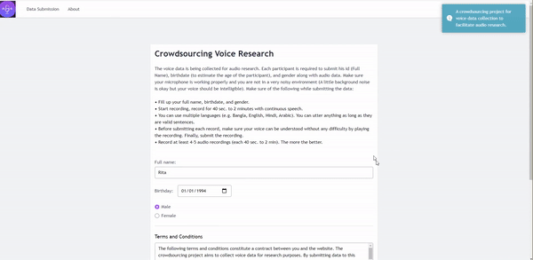

  

    <em>Crowdsourcing voice data for audio, speech research.</em>

---
### Requirements

1. Flask `pip install Flask`
2. waitress `pip install waitress`

### Run in local network

* Install openssl. `apt install openssl`

* Generate certs. `openssl req -x509 -newkey rsa:4096 -keyout key.pem -out cert.pem -sha256 -days 365`

* Enter passphrase: `passphrase: 1234`

* Install Nginx. `apt update` `apt install nginx`

* Copy the files. `cp default.conf /etc/nginx/sites-available/default; cp key.pem /etc/nginx/sites-available/key.pem; cp cert.pem /etc/nginx/sites-available/cert.pem;`

* Run the app (probably inside a docker container). `python3 main.py`

* Restart server. `service nginx restart`

### Support

> **Tested with:** `python3.6` `python3.7` `python3.8`

> **TO-DO:**
 - [x] nginx config
 - [x] self-signed certs
 - [ ] live app

### Others
> Any contribution is welcome. 
  - [Contributors](https://github.com/zabir-nabil/crowdsource-voice-research/graphs/contributors)

